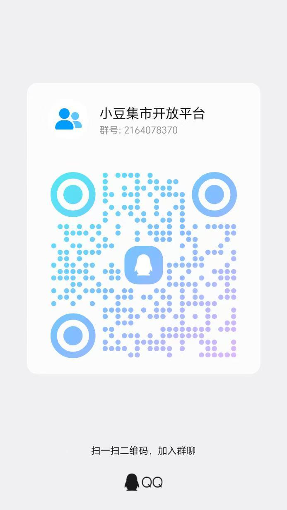

# 小豆支付开放平台 · 虚拟发卡 / 数字商品的支付接入资料（支付宝 + 微信聚合收款 · 持牌机构清算）

> 线上入口（买家浏览与**卖家中心 / 免费开店**都在这里）：<https://xdjishi.cn/>

> **可点击演示**（不用注册、零联网，数据全为演示值；在浏览器里点着走完「申请 → 收款 → 到账」）：<https://xdfair.cn/demo/>

**你已经有一套卖虚拟商品的系统，只缺「收钱」这一环？** 卡密、激活码、课程、专栏、电子书、软件、素材模板、会员权益、游戏道具——**凡是线上交付的数字商品**都能用它收款；**当面交易的实物**也可以。

**没有营业执照也没关系——个人就能申请。** 主体类型选「个人」：一张身份证 + 一张本人银行卡，跟着向导走完入驻，手续极简；个体工商户与企业同样支持。

这套接口就是干这个的：帮你把**支付宝和微信**收进来，告诉你「钱到没到」，再把钱结给你。下单、查单、关单、退款、通知事件，一共六个接口。

钱由**有支付牌照的支付公司**收和结，**不经过我们的账户**——我们只负责把状态讲清楚，货还是你的系统自己发。

费用**全平台统一一档**：平台服务费 1.5%（商家实收 98.5%），手续费 0.01 元起；每一单的准确金额仍以响应里的 `feeProjection` 为准。**入驻、开通、接入对接全程免费**：没有搭建费、入驻费、开通费，也不另收通道费，没有任何一次性收费。

这个仓库就是它的**全部接入资料**：12 篇文档、四种语言的签名示例、一个能跑起来的本地演示，还有一份可以直接丢给 AI 编码助手（Claude Code、Codex 之类）的 Skill。**跟你在商家后台看到的是同一份内容。**

> 版本看 [`MANIFEST.json`](./MANIFEST.json)（`skillVersion`、API 版本、签名版本、`contentHash` 都在里面）。
> 这里是**接入资料，不是官方 SDK**——我们不发包，示例代码是给你直接抄的参考实现。
> 这里是这份资料的**唯一出处**：商家后台里的那版和公开发布的这版，都由这里产出。

**这个仓里有什么（不用先申请账号，直接拿）**：

- **12 篇接入文档** —— 从「5 分钟跑通首单」到终端行为、错误码、上线检查、密钥轮换；
- **四种语言的签名示例**（Node.js / Java / PHP / Python），带一份**可以自己跑的对照值**；
- **本地演示**（`demo/h5-cashier/`）—— 零依赖，断网也能跑通「下单 → 收款 → 查单 → 关单 → 退款 → 收通知」整条链；
- **一份 AI Agent Skill**（[`skill/`](./skill/SKILL.md)）—— 丢给编码助手就能照着接，和后台下载的那份一模一样。

## 先说清楚：这是干什么的、不干什么

一句话：**你负责卖货和发货，我们负责收钱、把状态讲清楚、按设置把钱结给你。**

我们做的是**支付**这件事，不是帮你开网店：

| 我们做 | 你做 |
| --- | --- |
| 下单、收钱、支付状态和终态通知 | 商品、库存、定价、页面 |
| 查单、关单、退款、退款查询 | **发货本身**：发卡密、开通服务、寄快递、开票、售后 |
| 每一单的费用明细（`feeProjection`）与结算 | 你自己的订单库、对账、客服 |
| 域名归属验证（可选自助）、IP 白名单、三套签名（请求 / 响应 / 通知） | 保管和轮换你自己的密钥 |

**发货是你自己的事**：收银页上不放货，`returnUrl`（付完跳回来那个地址）**也不代表付款成功**——到底成没成，只认「查单」或者验过签的「事件通知」。这两件事搞错的团队最多，详见[接入指南](./docs/02-integration-guide.md)。

## 适合谁、不适合谁

| | |
| --- | --- |
| ✅ 适合 | 你已经有自己的发货 / 开通系统，想要一条**H5、JSAPI**收款通道：建单、拿收款码、收终态通知、退款、对账。 |
| ✅ 适合 | **个人 / 没有营业执照的个人开发者**：主体类型选「个人」，身份证 + 本人银行卡即可完成入驻，接口与其他主体完全一致。 |
| ✅ 适合 | 你卖的是**虚拟卡密类数字商品**，或者**当面交易的实物**。 |
| ✅ 适合 | 你的买家要用**支付宝**或**微信**付款。 |
| ❌ 不适合 | 你想要「上传卡密就能开卖」的一站式发卡系统 —— 那用**小豆集市**的卖家后台（见下一节），不用写代码。 |

## 两条路，选一条

| 你的情况 | 走哪条 |
| --- | --- |
| 已经有自己的发卡 / 发货系统，只缺**收钱和结钱** | **本开放平台**：接这六个接口，发货还是你自己发 |
| 还没有系统，就想**上架卡密直接开卖** | **小豆集市**（卖家后台）：上架商品、导卡密，买家付完钱自动发卡，订单售后结算都在后台 |
| 两个都想要 | 可以。同一个人既是小豆集市的卖家、又是开放平台的商家，钱路是同一条 |

> **想直接开店卖货（不用写代码）**：小豆集市的产品说明也在公开仓，**同样不用注册就能看** ——
> [GitHub](https://github.com/xiaodou-official/xiaodou-market) ｜ [Gitee 镜像](https://gitee.com/lu-wulei/xiaodou-market)

> **卖家在手机上管店**：用微信小程序「小豆集市」——卖家的手机经营台（看商品 / 订单 / 结算；
> 上货、进件与售后办理仍在网页端）。买家侧在 <https://xdjishi.cn/>，全程免注册。

## 接口一览

**六个接口**（路径拼在平台给你的 `<BASE_URL>` 后面，主版本 `v1`，版本内只加不改）：

| 接口 | 干什么 |
| --- | --- |
| `POST /api/open/v1/payments` | 建订单（同一个单号重复提交不会建两笔） |
| `POST /api/open/v1/payments/{outTradeNo}/attempts` | 重新拉一次支付（换一份新的收款材料） |
| `GET /api/open/v1/payments/{outTradeNo}` | 查订单（以我们这边为准） |
| `POST /api/open/v1/payments/{outTradeNo}/close` | 关订单（会先跟支付公司确认没付过款） |
| `POST /api/open/v1/refunds` | 发起退款 |
| `GET /api/open/v1/refunds/{outRefundNo}` | 查退款 |

**收款材料有两种标准用法**：在**你自己的电脑网页**上把官方收款码（`qrCode`，只有支付宝渠道会给）画成二维码；或者把我们的收银页地址（`payUrl`）画成二维码、或者直接 `302` 跳过去。细节见[收银页对接](./docs/06-cashier-integration.md)。

**三套签名，别用同一段代码**：你发给我们的请求要签（`XD-Signature-v1`）、我们的响应要签（`XD-Response-v1`）、通知事件也要签（`XD-Webhook-v1`）。**三套拼串规则不一样**，抄同一段一定会挂；我们的公钥和指纹在[接入指南 §3.1](./docs/02-integration-guide.md#31-平台公钥与指纹公示)里公开。

**四条铁律，记住能少踩九成的坑**：

1. **收银页打开了、买家付完跳回来了、点了「我已完成支付」——都不算付款成功**。只有查单、或者验过签的通知才算数。
2. **重试要用同一个 `requestId`、同一份请求内容**。收到 `409` 该做的事是**去查单**，不是换个单号重新下单。
3. **看到 `UNKNOWN` 别急着判死**：不要重新下单、不要重发退款、不要跟买家说「失败」，等通知或者查单收敛。
4. **私钥永远不进浏览器、不进仓库、不进日志**。费率和限额**不要写死在代码里**——每一单响应里的 `feeProjection` 才是那一单的真实口径。

## 常见叫法与本资料的对应（你可能这样搜）

| 你可能用的叫法 | 在本资料里对应什么 |
| --- | --- |
| 支付平台 / 聚合支付 / **聚合收款** / 聚合码支付 | 一套接口同时接**支付宝和微信**两条通道（`ALIPAY_H5` / `WECHAT_H5`），通道在**下单那一刻定死**；我们聚合的是**接入、状态和对账**，钱的收付结算是持牌支付公司做的 |
| **支付接口** / 支付 API / 云支付 | 就这六个：建单、重拉、查单、关单、退款、查退款（见[接口一览](#接口一览)） |
| **个人支付** / **个人收款** / 个人开发者收款 | **个人可以申请**：主体类型选「个人」，身份证 + 本人银行卡即可入驻，接口与个体工商户 / 企业完全一致（见[怎么开通](#常见问题faq)） |
| **收款通道** / 收款接口 / 支付通道 | 就是本仓这六个接口：一条**服务器对服务器**的收款通道，钱由持牌支付公司收付结算（见[接口一览](#接口一览)） |
| **免费接入** / 免搭建费 / 不收入驻费 | **入驻、开通、接入对接全程免费**——没有搭建费、入驻费、开通费，也不另收通道费（见[资金与结算](#资金与结算)） |
| **H5 支付** / H5 远程支付 | 我们的收银页（`payUrl`）：电脑扫码、手机浏览器、微信里打开，三种情况行为不一样（见[终端能力矩阵](./docs/06-cashier-integration.md)） |
| **收款码** | 下单响应里的**官方收款码** `qrCode`（只有支付宝渠道给，而且只有**下单那一次响应**里有），可以直接画在你自己的电脑网页上 |
| **微信收款 / 支付宝收款** | 两条通道的能力面都做好了；**支付宝现在就能接**，**微信通道放行以平台公告/对接人通知为准**（放行由平台整体控制、不区分应用，后台没有查询面；未放行时下单返回一个可预期的拒绝，见 [FAQ](#常见问题faq)） |
| **虚拟发卡** / 卡密 / 自动发货 / 发卡系统 | 我们只管收钱和支付状态，**发货是你自己的系统发**；不想写代码就去[小豆集市的卖家后台](#两条路选一条) |
| **次日到账 / 次日提现** / 自动结算到银行卡 | 付成功就当场分账，然后按设置**自动转到你绑定的银行卡**——现在是**第二天到账（含节假日）**，**不用你手动提现**（见[资金与结算](#资金与结算)） |
| **持牌机构** / 资金安全 / 资金托管 / 担保交易 | **央行持牌机构清算，安全可靠的个人和企业支付接口**。收付结算都是**有支付牌照的支付公司**做的，所以这里没有需要我们来「担保」的沉淀资金（跟[免签那类做法](#常见问题faq)的区别就在这） |
| 独立站收款 / 私域收款 / 知识付费收款 | 你只需要在服务器上接下单和通知，**页面、商品、发货都留在你自己的系统里** |
| 易支付 / 码支付 这类「**免签**」系统 | **不是一回事**，钱走的路完全不一样——见 [FAQ](#常见问题faq) 里的对比 |

> 这些都是行业里的习惯叫法，方便你对上号；**具体字段和取值以文档里写的为准**。

**English keywords（方便英文检索对上号 / so English searches can find us）**：

`payment gateway API` · `aggregate payment` · `Alipay + WeChat Pay integration` · `virtual goods payment` · `card key / digital code selling` · `faka platform payment` · `merchant payment API docs` · `RSA2 request signature` · `webhook signature verification` · `payment integration examples` · `Node.js / Java / PHP / Python signature sample` · `licensed payment institution settlement` · `openapi payment China`

## 资金与结算

- **央行持牌机构清算，安全可靠的个人和企业支付接口**：付成功就按**下单时定好的分配**当场分账，我们提供的是接入、状态和对账能力。
- **收付和结算都是有支付牌照的支付公司做的**，按设置**自动转到你绑定的银行卡** —— **不用你手动提现**。现在是**第二天到账**（含节假日）。
- **费率公开、全平台统一一档**：平台服务费 1.5%（商家实收 98.5%），手续费 0.01 元起。每一单响应里的 `feeProjection`（带 `ruleVersion`）就是那一单的准确口径，入账用它；如果你有单独约定过的费率，以商家后台「费率」页按账户实时展示为准。**限额**不在文档里写死（没有自助查询面，越界被拒时走官网反馈渠道）。
- **没有任何一次性收费**：入驻、开通、接入对接**全程免费**——不收搭建费、入驻费、开通费，也不另收通道费；我们会收的费用只有上一条那档按笔计的口径，没有隐藏项目。
- 结算周期、到账时间**都会变**：**一律看后台当时显示的**；通道放不放行以平台公告/对接人通知为准（后台无查询面）。别抄进你的对外文案或代码常量里。

## 五分钟上手

1. 读[快速开始](./docs/01-quickstart.md)：拿到 `appId`、`kid` 和私钥后，把第一笔请求跑通。
2. 用 [`examples/node/`](./examples/node/)（或 Java / PHP / Python）生成六个请求头，先拿 [golden 向量](./examples/README.md)对一遍，确认拼串没错。
3. 读[收银页对接与终端能力矩阵](./docs/06-cashier-integration.md)，决定你的收款页长什么样。
4. 接[事件通知验签](./docs/05-webhook-verification.md)，按 `eventId` 去重。
5. 上线前逐条过一遍[上线检查清单](./docs/11-go-live-checklist.md)。

**不想先申请账号？** 本地演示用回环地址 + 假数据把整条链跑通，不连线上、不需要任何凭证：

```bash
node demo/h5-cashier/server.js        # 商家控制台 + 终端预览 + 收银页示意
node demo/h5-cashier/smoke.js         # 冒烟自检（含负向用例），打印 [OK]
```

## 文档目录（12 篇）

| # | docId | 篇目 | 文件 |
| --- | --- | --- | --- |
| 1 | `XD-OP-01` | 快速开始（5 分钟跑通首单） | [`docs/01-quickstart.md`](./docs/01-quickstart.md) |
| 2 | `XD-OP-02` | 接入指南 | [`docs/02-integration-guide.md`](./docs/02-integration-guide.md) |
| 3 | `XD-OP-03` | API 参考 | [`docs/03-api-reference.md`](./docs/03-api-reference.md) |
| 4 | `XD-OP-04` | 错误码与排障 | [`docs/04-errors-and-troubleshooting.md`](./docs/04-errors-and-troubleshooting.md) |
| 5 | `XD-OP-05` | webhook 验签 | [`docs/05-webhook-verification.md`](./docs/05-webhook-verification.md) |
| 6 | `XD-OP-06` | 收银页对接与终端能力矩阵 | [`docs/06-cashier-integration.md`](./docs/06-cashier-integration.md) |
| 7 | `XD-OP-07` | 费率与限额 | [`docs/07-fees-and-limits.md`](./docs/07-fees-and-limits.md) |
| 8 | `XD-OP-08` | 退款与对账 | [`docs/08-refund-and-reconciliation.md`](./docs/08-refund-and-reconciliation.md) |
| 9 | `XD-OP-09` | 安全红线 | [`docs/09-security-redlines.md`](./docs/09-security-redlines.md) |
| 10 | `XD-OP-10` | 更新日志与变更公告 | [`docs/10-changelog.md`](./docs/10-changelog.md) |
| 11 | `XD-OP-11` | 上线检查清单（Go-Live Checklist） | [`docs/11-go-live-checklist.md`](./docs/11-go-live-checklist.md) |
| 12 | `XD-OP-12` | 凭证与密钥管理 | [`docs/12-credential-key-management.md`](./docs/12-credential-key-management.md) |

## 常见问题（FAQ）

**这是「虚拟发卡平台」吗？**
我们只做**收钱和支付状态**，发货（发卡密 / 开通 / 寄出）是你自己的系统做的。如果你要的是「上架卡密就能卖」，那用**小豆集市**的卖家后台，不用写代码；两边的钱路是同一条。

**微信和支付宝都能收吗？**
两条通道都做好了（支付宝：官方收款码 + 收银页；微信：在微信里打开页面后调起支付）。**支付宝现在就能接**；**微信能不能用，以平台公告/对接人通知为准**——通道放行由平台整体控制（不区分应用，后台没有查询面，也不要靠试探下单确认）。未放行时下单会返回 `422` `OPEN_API_CHANNEL_UNAVAILABLE`，这是**正常的、可预期的拒绝**，别当故障、更别反复重试。

**钱多久到账？要手动提现吗？**
付成功就当场分账，然后按设置**自动转到你绑定的银行卡**——**不用手动提现**。现在是**第二天到账**（含节假日）；周期和时效会随渠道和设置变，以后台「资金 / 结算」页显示的为准。

**你们会经手或者压着我的钱吗？**
不会。**央行持牌机构清算，安全可靠的个人和企业支付接口**：收付和结算都是有支付牌照的支付公司做的，付成功就按定好的分配当场分到各方。

**你们是「易支付 / 码支付」那类系统吗？**
不是，钱走的路完全不一样。那类叫法一般指**免签 / 第四方代收**：先用个人收款码或别人的账户把钱收进来，再转给卖家，**钱会经过中间方的账户**。我们是另一条路：**商家在有支付牌照的支付公司开自己的结算账户**，买家付完钱，钱在公司那边**当场分到各方账户**，再按设置转到你绑定的银行卡 —— **央行持牌机构清算，安全可靠的个人和企业支付接口**。你要是想要前一种，我们做不了；你要是想要「自己有正规结算账户 + 一套接口接完支付宝和微信 + 第二天自动到账」，接着往下看。

**手续费多少？**
**平台服务费 1.5%（商家实收 98.5%），全平台统一一档，手续费 0.01 元起。**每一单响应里的 `feeProjection` 就是那一单的准确口径（带 `ruleVersion`，拿它对账）；如果你有单独约定过的费率，以商家后台「费率」页按账户实时展示为准。限额没有自助查询面（越界被拒时走官网反馈渠道，附 `requestId`）。详见[费率与限额](./docs/07-fees-and-limits.md)。

**要交搭建费 / 入驻费 / 通道费吗？**
都不用。**入驻、开通、接入对接全程免费**：不收搭建费、不收入驻费、不收开通费，也不另收通道费。我们会收的费用只有上面写明的那一档（按笔计），没有一次性收费、没有隐藏项目。市面上有些平台会先收一笔搭建费或通道费、再叠加抽成；在我们这里，这份资料里写的费用就是全部。

**有沙箱或测试环境吗？**
暂时没有沙箱、测试应用和回调模拟器。替代办法：本地演示（零依赖，全链路假数据）+ [上线检查清单](./docs/11-go-live-checklist.md) + 第一笔线上小额单我们陪你盯（**不承诺 SLA**）。**本地跑通只能证明签名和解析没错，证明不了资金链通。**

**要自己写代码吗？用什么语言？**
接入是**服务器对服务器**的：下单 / 查单 / 退款 + 通知验签。仓库给了 Node.js、Java、PHP、Python 四份签名示例，**拼出来的串完全一样**，还带对照值；通知验签另有 Node 的参考实现。

**收银页能自己设计吗？**
两种标准做法：在**你自己的页面**画官方收款码，或者把 `payUrl` 画成二维码 / 直接 `302` 跳过去。**别照抄我们收银页的样子**——真正的收银页在我们这边、而且是品牌中立的；也别在你自己的 App 里用内置浏览器打开，必须跳到系统浏览器。

**怎么开通？个人可以申请吗？**
**可以，个人就能申请——没有营业执照也行。** 从页首那个入口进「卖家中心 / 免费开店」→ 注册小豆账号 → 完成**商户进件**（主体类型选「个人」：上传身份证正反面、填一张本人银行卡，五步向导、手续极简；个体工商户与企业同理，另加营业执照）→ 签开放平台服务协议和经营范围合规报送同意书 → **一键申请应用**（提交后自动审）→ 拿到 `appId`、`kid`，登记你的 RSA2 公钥、配好出口 IP 白名单和 `notifyUrl`。申报域名由你自己填写，**平台不强制核验归属**——顺手做一次**域名归属验证**（DNS TXT 或者放一个回源文件，二选一）会更稳妥：域名被他人冒用申报时，验证过的归属更明确。

**密钥怎么轮换？**
我们用同一把 RSA2 密钥给响应和事件签名，公钥和指纹在文档页和后台**两处都公开**（你可以自己算一遍指纹核对）。你自己的签名密钥可以自己换；我们这边换钥会同时发布新的 `kid` 和新公钥，新旧并存期间按 `kid` 选公钥。**紧急吊销不受宽限影响**，宽限窗最长 72 小时。详见[凭证与密钥管理](./docs/12-credential-key-management.md)。

## 目录结构

```
README.md          本文件（简介 / 索引 / 版本 / 许可证 / 免责）
MANIFEST.json      机器可读清单（版本、逐篇 hash、包 contentHash、发布记录）
PUBLISHING.md      公开发布参数与流程
docs/              接入文档 12 篇
examples/          Node.js / Java / PHP / Python 四语言签名示例
demo/h5-cashier/   本地收银演示（回环 + 假数据，零外部依赖）
skill/             商家接入 Skill（给 AI 编码助手用，与 docs 同源）
releases/          变更公告正文（后台公告、更新日志、公开发布页共用同一份）
assets/            公开仓页面用的图片（如官方 QQ 群二维码）
```

## 写这份资料时守的规矩

- **金额**一律用整数「分」（字段后缀是 `Fen`），只支持人民币。
- **字段名**：能机器读的地方一律用我们的字段名（形如 `qrCode`），不出现上游系统的原始字段名。
- **发货**：我们只负责收钱和支付状态；**卡密、发货这些交付动作由你自己的系统承担**——收银页上不放货。
- **什么才算付款成功**：收银页打开了、跳回来了、买家点了「完成」，**都不算**；只有查单的结果、或者验过签的通知才算。
- **费率**：全平台统一一档，写在上面了（入账对账口径以每单 `feeProjection` 为准）。**限额、到账时效、通道放行**会变：这份资料不写死它们的数字，只告诉你「去哪儿看当前值」。

## 许可证

- **内容**（文档、接入说明、变更公告、图示文本）：[CC BY 4.0](./LICENSE) —— 可自由转载与演绎，须按许可条件**署名**并**标明修改**。
- **示例代码**（`examples/`、`demo/`、`skill/examples/`）：[MIT](./LICENSE-CODE)。

## 官方 QQ 群

接入过程中卡住了（签名、下单、收银页、事件通知、上线自检），直接进群问——**官方群，没有第三方代运营**。
**扫码**或者按 **群号 `2164078370`** 搜索都能加：



## 反馈与 Star

- 发现文档和接口对不上、或者示例代码有问题：欢迎开 Issue，我们会在后续版本修掉并记到[更新日志与变更公告](./docs/10-changelog.md)。
- 如果这份资料帮你省下了翻文档的时间，**点个 Star** 能让更多在做虚拟发卡 / 数字商品收款的同行找到它。

## 支持边界

**暂时没有沙箱 / 测试应用 / 回调模拟器。**替代办法 = 本地演示（本目录）+ 上线检查清单 + 第一笔线上单人工陪你盯（不承诺 SLA）。

本目录由运营主体**宇智人工智能（深圳）有限公司**维护；**收付与结算由有支付牌照的支付机构提供**——**央行持牌机构清算，安全可靠的个人和企业支付接口**。接入和上线以平台在线合同、后台显示的实际配置、以及接口的真实行为为准。
